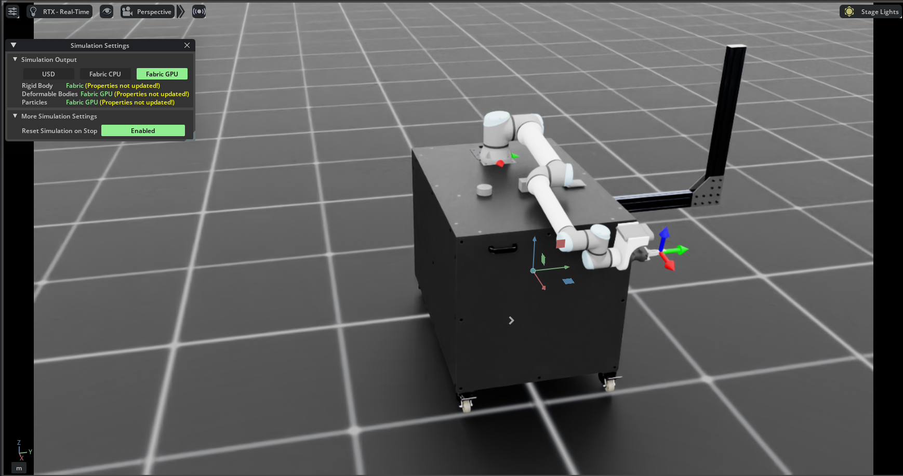

# Robotic Grasping with Reinforcement Learning

## Project Overview

This project implements a deep reinforcement learning system for robotic manipulation in Isaac Lab, focusing on grasping diverse objects using RGB-D visual input. The system trains a UR10e manipulator with a Robotiq Hand-E gripper to grasp three different objects:

- **Tin Can** - Cylindrical metallic object
- **Tetra Pak Carton** - Rectangular cardboard packaging
- **Chips Bag** - Deformable plastic packaging

### Simulation Environment

<p align="center">
  
  <br>
  <em>Isaac Lab simulation scene with UR10e manipulator, Hand-E gripper, and target objects on table</em>
</p>

---
  ### 1. Hierarchical Approach
  **Idea**: Decompose into two stages - (1) RL predicts 6-DoF grasp pose from visual features, (2) state machine + IK executes the grasp.

  ---

  ### 2. End-to-End + Vision 
  **Idea**: Direct mapping from visual features (7D from RGB-D camera) to joint commands, no hierarchical decomposition.

  ---

  ### 3. End-to-End + Ground Truth
  **Idea**: Direct mapping from privileged observations (joint states + ground-truth object pose) to joint commands.


---

## Current System Architecture

### Observation Space
```python
- Joint positions (6D): Relative to default pose
- Joint velocities (6D): Angular velocities
- Object position (3D): In robot root frame
- Object orientation (4D): Quaternion in robot root frame
- Target position (7D): Goal pose command
- Previous actions (8D): For temporal consistency

Total: 34 dimensions
```

**Note**: Ground-truth object pose used for faster training. Vision-based alternative available but disabled.

### Action Space
```python
- Arm joint positions (6D): Delta commands for UR10e
  Scale: 0.5
- Gripper (2D): Binary open/close command
  Open: 0.0425m, Close: 0.0m

Total: 8 dimensions
```

### Reward Function (Weighted Sum)
```python
reaching_object:          +1.0  × exp(-d²/0.1)      # Distance to object
lifting_object:          +15.0  × lifted             # Binary lift success
object_goal_tracking:    +16.0  × exp(-d²/0.3)      # Coarse goal proximity
goal_tracking_fine:       +5.0  × exp(-d²/0.05)     # Fine goal proximity
action_rate_penalty:      -0.1  × ||Δa||²           # Smooth actions
joint_velocity_penalty:  -0.01  × ||v||²            # Reduce jerkiness
joint_acceleration:      -1e-5  × ||a||²            # Reduce oscillations
```

### Training Configuration
- **Algorithm**: PPO (Proximal Policy Optimization)
- **Framework**: RSL-RL (ETH Zurich)
- **Parallel Envs**: 4096 (replicate_physics=True)
- **Horizon**: 5s episodes (250 steps @ 50Hz control)
- **Learning Rate**: Adaptive (RSL-RL default)
- **Batch Size**: 4096 × 250 = 1,024,000 steps per iteration


---

## Repository Structure

```
robotic-grasping-rl/
├── assets/                      # Custom robot assets
│   └── ur10_with_gripper.py    # UR10e + Hand-E configuration
├── objects/                     # 3D models (USD format)
│   ├── tin-can.usd
│   ├── tetra-pak-carton.usd
│   └── chips-bag.usd
├── manip_tasks/
│   ├── tasks/
│   │   └── ur10_lift_env_cfg.py      # Environment configuration
│   ├── observations.py               # Custom observation functions
│   ├── rewards.py                    # Custom reward functions
│   └── agents/                       # PPO agent configuration
├── scripts/
│   ├── train.py                      # Training script
│   ├── play.py                       # Inference/evaluation
│   ├── spawn_scene.py                # Visualization tool
│   └── debug_camera_view.py          # Camera debugging
└── logs/rsl_rl/                      # Training logs & checkpoints
```

---

## How to Run

### 1. Environment Setup
```bash
# Requires Isaac Sim 5.1.0 and Isaac Lab 0.50.3
cd IsaacLab
./isaaclab.sh -p -m pip install -e .
```

### 2. Training
```bash
cd robotic-grasping-rl
python scripts/train_ur10_lift.py --task Isaac-Lift-UR10-v0 --num_envs 4096 --max_iterations=5000 --headless
```


### 3. Inference/Evaluation
```bash
python scripts/play_ur10_lift.py --task Isaac-Lift-UR10-v0 --num_envs 40
```

### 4. Visualization
```bash
# Spawn scene without training to inspect setup
python scripts/spawn_scene.py --num_envs 1
```

